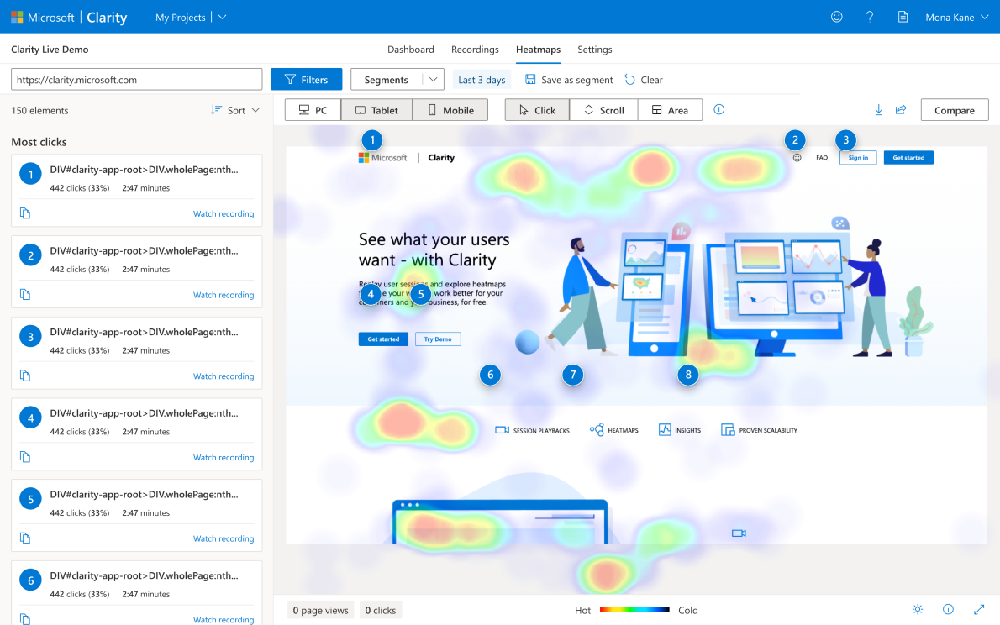

# PowerApps-PowerHeat

## Overview

This repository contains the PowerHeat, a component framework control to add Microsoft Clarity integration to Power Apps. You can learn more about [Microsoft Clarity](https://learn.microsoft.com/en-us/clarity/faq) but a quick intro would be: 

> Clarity is a user behavior analytics tool that helps you understand how users interact with your website. Supported features include:  
*Session Recordings  
*Machine Learning Insights  
*Heatmaps (or heat maps)

A picture is worth a thousand words, so you can check how it looks like in the screenshot

## Useful Links

- [Announcement Test Engine](https://powerapps.microsoft.com/en-us/blog/introducing-test-engine-an-open-platform-for-automated-testing-of-canvas-apps/)
- [Test Engine Source Code](https://github.com/microsoft/PowerApps-TestEngine)
- [Power Fx Overview](https://learn.microsoft.com/en-us/power-platform/power-fx/overview)

## Getting Started

The powerheat component is distributed as a .NET Tool from NuGet.org. The installation of the tool is managed with the dotnet CLI.

### Installing PowerHeat

You can build the component from source code, following the [tutorial](https://learn.microsoft.com/en-us/power-apps/developer/component-framework/implementing-controls-using-typescript?tabs=before). 

On the other hand, you need to get a projectID from the Microsoft Clarity website.

Install manually to get the project clarity code:

and include it into the app:

## Getting Help
For feature requests or issues using this tool please open an issue in this repository.

Feedback is welcome! Please let me know what you think by opening an [issue](../../issues).

## Contributing
We welcome community contributions and pull requests. See CONTRIBUTING for information on how to set up a development environment and submit code.

## License
This repository is licensed under the MIT License. See LICENSE and NOTICE for more information.
